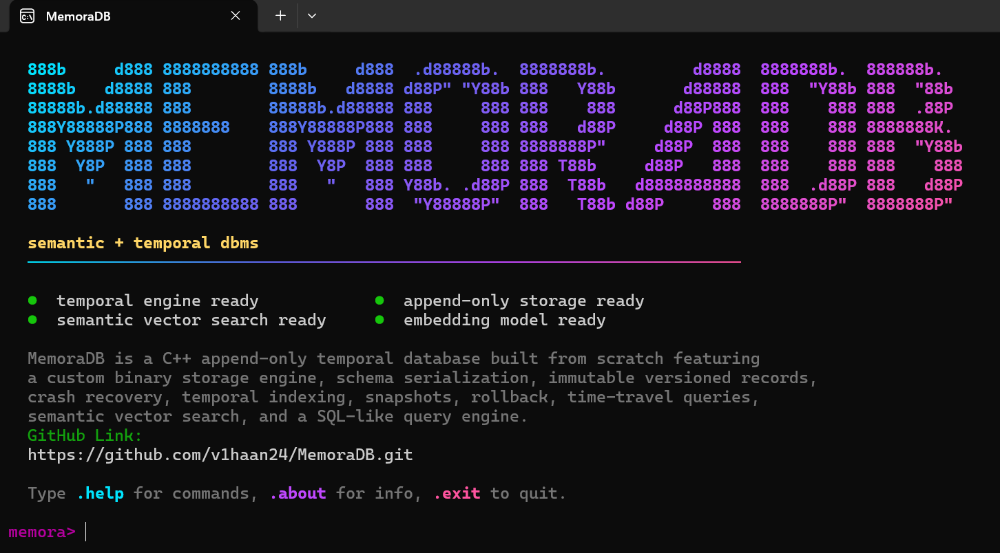

# MemoraDB

[](https://github.com/v1haan24/MemoraDB/releases)
[](#)
[](#)
[](#)
[](#)

> **A custom C++17 relational database management system featuring append-only binary storage, immutable temporal versioning, and in-process neural semantic search powered by ONNX Runtime.**

<p align="center">
  
</p>

---

## Overview

Traditional relational databases overwrite records destructively in place, treating past state as ephemeral. Specialized vector databases offer semantic search but lack relational schema constraints and temporal history.

**MemoraDB unifies both worlds:**
* **Zero-Loss Immutability**: Every `INSERT`, `UPDATE`, and `DELETE` operation appends an immutable binary record tagged with a millisecond timestamp. Deleted rows receive tombstones rather than being excised from disk.
* **In-Process Semantic Search**: Embeds Microsoft's ONNX Runtime and the `all-MiniLM-L6-v2` transformer model directly into the query execution engine. Text columns declared `SEMANTIC` are indexed as 384-dimensional dense vectors and queried using the `SIMILAR TO` operator without any external vector database daemon.
* **Native Time-Travel & Diffs**: Query tables as of historical instants (`AS OF`), over intervals (`BETWEEN`), trace field-level mutations (`EVOLUTION`), compute net differences (`COMPARE`), and roll back individual rows or entire tables (`ROLLBACK`).

---

## Quick Start

### 1. Prerequisites
* **C++17** compiler (Visual Studio 2022, GCC 9+, or Clang 10+)
* **CMake 3.20+**
* **Git**
* *(Recommended)* **Ninja**

Install tools on Windows using `winget`:
```powershell
winget install --id Kitware.CMake -e
winget install --id Ninja-build.Ninja -e
```

### 2. Clone the Repository
```bash
git clone https://github.com/v1haan24/MemoraDB.git
cd MemoraDB
```

### 3. Build & Run

#### Option A: With Ninja (Recommended)
```powershell
cmake -G "Ninja" -S . -B build
cmake --build build --config Release
.\build\memora.exe
```

#### Option B: Without Ninja (MinGW Makefiles)
```powershell
cmake -G "MinGW Makefiles" -S . -B build
cmake --build build --config Release
.\build\memora.exe
```

On Linux or macOS:
```bash
cmake -G "Ninja" -S . -B build -DCMAKE_BUILD_TYPE=Release
cmake --build build
./build/memora
```

---

## Running the Automated Test Suite

MemoraDB includes a comprehensive automated unit and integration test suite powered by GoogleTest and CTest:

```bash
# Configure and compile tests
cmake -G "Ninja" -S . -B build-tests -DMEMORA_BUILD_TESTS=ON
cmake --build build-tests

# Run all tests
ctest --test-dir build-tests --output-on-failure
```

---

## Example Usage

Launch `memora.exe` and execute statements in the terminal shell:

```sql
-- 1. Create a table with temporal and semantic search support
CREATE TABLE documents (
    id INT PRIMARY KEY,
    title STRING(60),
    content STRING(500) SEMANTIC
);

-- 2. Insert records
INSERT INTO documents VALUES (1, 'Kubernetes Setup', 'Deploying containerized workloads using Kubernetes clusters.');
INSERT INTO documents VALUES (2, 'Pasta Recipe', 'Traditional Italian lasagna with homemade tomato sauce.');

-- 3. Query conceptually using machine learning embeddings
SELECT * FROM documents WHERE content SIMILAR TO 'cloud container orchestration' LIMIT 5;

-- 4. Update a record (appends a new immutable version)
UPDATE documents SET content = 'Kubernetes and Docker deployment architecture on cloud nodes.' WHERE id = 1;

-- 5. Time-travel query: inspect historical state
HISTORY documents WHERE id = 1;
SELECT * FROM documents AS OF 2026-09-20 WHERE id = 1;

-- 6. Revert to a previous point in time
ROLLBACK documents WHERE id = 1 TO 2026-09-20;
```

---

## Documentation

Full documentation, SQL reference manuals, architecture guides, and tutorials are available at:
👉 **[https://v1haan24.github.io/MemoraDB/](https://v1haan24.github.io/MemoraDB/)**

To run the documentation locally:
```bash
pip install mkdocs-material
mkdocs serve
```

---

## Repository Structure

```text
MemoraDB/
├── src/
│   ├── catalog/       # Table schema catalog & persistence
│   ├── cli/           # Interactive TrueColor REPL shell
│   ├── common/        # Constants, metadata, and time utilities
│   ├── engine/        # Statement dispatcher & execution engine
│   ├── index/         # In-memory chronological history index
│   ├── lexer/         # Tokenizer & lexical scanner
│   ├── parser/        # Recursive-descent SQL parser & AST
│   ├── query/         # Filtering, projection, and sorting
│   ├── storage/       # Binary append-only storage & crash recovery
│   ├── temporal/      # AS OF, BETWEEN, SNAPSHOT, EVOLUTION, ROLLBACK
│   └── vector/        # ONNX Runtime embedder & vector index
├── test/              # GoogleTest test suites (unit, temporal & integration)
├── docs/              # Material for MkDocs documentation source
├── commands/          # Build scripts & quick reference commands
├── CMakeLists.txt     # Meta-build system
└── mkdocs.yml         # Documentation site configuration
```

---