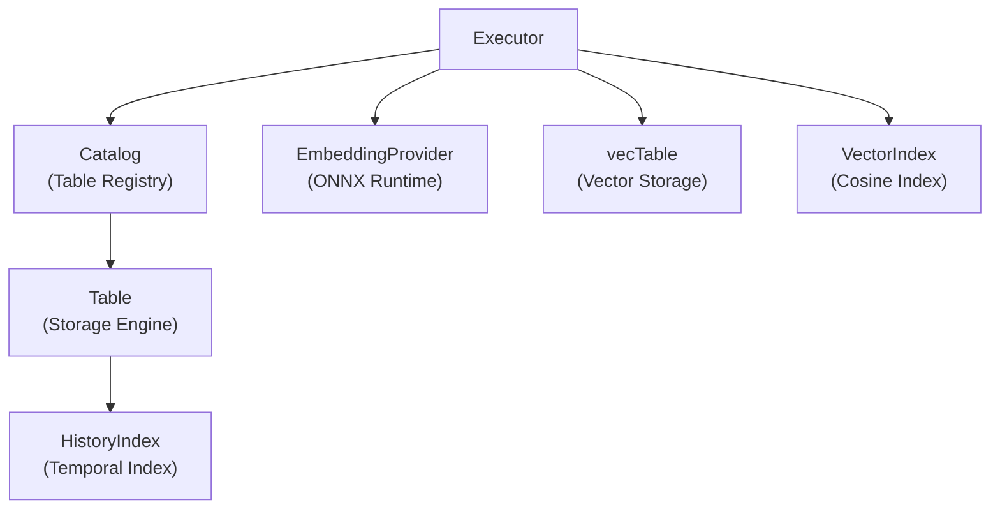

# Query Executor Architecture

The `Executor` orchestrates query processing, translating AST statements into concrete operations across the storage, temporal, and semantic vector engines.

---

## Source Location

* **Header**: `src/engine/executor.h`
* **Implementations**:
  * `executor.cpp` — Core class, timestamp conversion, column resolution, operator mapping.
  * `executor_dml.cpp` — Execution logic for `CREATE`, `DROP`, `DESCRIBE`, `SHOW`, `INSERT`, `UPDATE`, `DELETE`.
  * `executor_query.cpp` — Execution logic for `SELECT` (ordinary and semantic branches).
  * `executor_temporal.cpp` — Execution logic for `COMPARE`, `EVOLUTION`, `HISTORY`, `ROLLBACK`, `COMPACT`.

---

## The Execution Model

The `Executor` uses modern C++17 `std::visit` to pattern-match against the `Statement` variant:

```cpp
ExecResult Executor::execute(const Statement& stmt) {
    return std::visit([this](auto&& s) -> ExecResult { 
        return this->run(s); 
    }, stmt);
}
```

Each statement type has an overloaded `run(...)` method that handles validation, coordination, and error reporting.

---

## The `ExecResult` Structure

Statements return an `ExecResult` object communicating status, data payloads, and error messages:

```cpp
struct ExecResult {
    enum class Kind {
        OK,      // Command succeeded with status message (e.g. "1 row inserted")
        ROWS,    // Query returned relational records
        DIFFS,   // Query returned difference records (COMPARE / EVOLUTION)
        SEARCH,  // Query returned ranked semantic search results
        ERROR    // Query failed
    };
    Kind kind = Kind::OK;
    std::string message;
    std::vector<Record> records;
    std::vector<ColMeta> columns;
    std::vector<Difference> diffs;
    std::vector<SearchResult> search;

    bool ok() const { return kind != Kind::ERROR; }
};
```

---

## Subsystem Coordination

The Executor serves as the central hub connecting all DBMS components:



### Vector Handle Management
The executor lazily manages handles to companion vector tables via `vectorsFor(Table& table)`:
* Checks if any column has `isSemantic = 1`.
* If `data/<name>/<name>.vec` exists, opens `vecTable` and builds `VectorIndex`.
* Caches the open handles in `std::unordered_map<std::string, VectorHandles>`.

---

## Date & Timestamp Conversion Helpers

The Executor provides static methods to convert civil calendar dates (`DateLiteral`) to epoch milliseconds:

* `Executor::dayStartMs(d)`: Converts civil date to local epoch seconds, multiplying by 1000 and adding milliseconds. If time is omitted, returns midnight (`00:00:00.000`).
* `Executor::dayEndMs(d)`: If time was explicitly provided, delegates to `dayStartMs(d)`. If time was omitted, advances by 1 day and subtracts 1 millisecond, yielding `23:59:59.999`.
