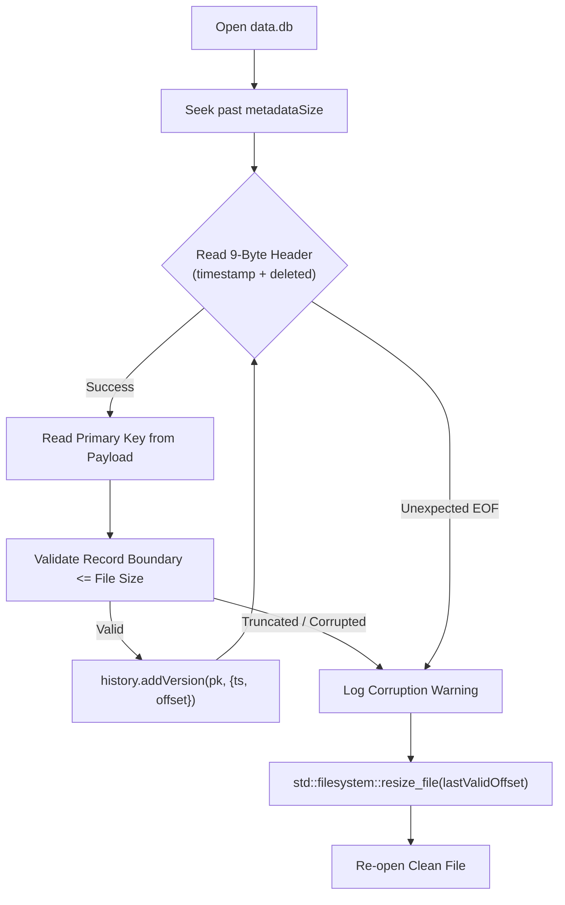

# Storage Engine Architecture

The MemoraDB storage engine provides an append-only, binary persistence layer with automated crash recovery and non-destructive compaction.

---

## Source Location

* **Header**: `src/storage/table.h`
* **Implementations**:
  * `table.cpp` — File descriptor management and table lifecycle.
  * `insert.cpp` — Appending new row records.
  * `update.cpp` — Appending updated row versions.
  * `delete.cpp` — Appending tombstone records.
  * `read.cpp` — Seeking to offsets and reading binary payloads.
  * `recovery.cpp` — Startup state recovery and file truncation.
  * `compact.cpp` — Pruning superseded history and archiving data.
  * `serialization.cpp` — Low-level binary I/O routines.

---

## Binary File Format: `data.db`

Each table stores all its data in a single binary file located at `data/<table_name>/data.db`:

```text
┌────────────────────────────────────────────────────────────────────────┐
│                        Table Metadata Block                            │
├───────────────────┬──────────────┬───────────────┬─────────────────────┤
│ metadataSize (4B) │ name (30B)   │ payloadSz(4B) │ columnCount (4B)    │
├───────────────────┴──────────────┴───────────────┴─────────────────────┤
│ Column Metadata 1: [name(30B)][type(4B)][size(4B)][offset(4B)][pk][sem]│
│ Column Metadata 2: ...                                                 │
├────────────────────────────────────────────────────────────────────────┤
│                          Record Sequence                               │
├─────────────────────────┬──────────────────────────────────────────────┤
│ Record 1 Header (9B):   │ [timestamp (8B, uint64_t)][deleted (1B)]     │
│ Record 1 Payload:       │ [col1 value][col2 value]... (payloadSize)    │
├─────────────────────────┼──────────────────────────────────────────────┤
│ Record 2 Header (9B):   │ [timestamp (8B, uint64_t)][deleted (1B)]     │
│ Record 2 Payload:       │ [col1 value][col2 value]... (payloadSize)    │
└─────────────────────────┴──────────────────────────────────────────────┘
```

### 1. Header Sizing
* `rhsz` = `sizeof(uint64_t) + sizeof(uint8_t)` = **9 bytes**.
* `tns` = Fixed table name size = **30 bytes**.
* `cns` = Fixed column name size = **30 bytes**.

### 2. Fixed-Payload Layout
Because column sizes are fixed (`STRING(n)` has size `n`), every record for a given table has the exact same byte length: `9 + payloadSize`. This guarantees that record offsets can be navigated deterministically.

---

## Crash Recovery on Startup (`Table::recoverState`)

When a table is loaded (either at REPL startup via `Catalog::loadTables()` or on first reference), MemoraDB verifies storage integrity:



1. **Sequential Scan**: Seeks past `metadataSize` and iterates through records sequentially.
2. **Boundary Validation**: Checks that `recordStart + 9 + payloadSize <= file_size`.
3. **Index Reconstruction**: Inserts `{timestamp, recordStart}` into `HistoryIndex`.
4. **Automatic Truncation**: If an incomplete write occurred (e.g., due to a system crash or power cut while writing a payload), MemoraDB truncates the file back to `lastValidOffset` using `std::filesystem::resize_file`. The file is restored to a 100% consistent state without user intervention.

---

## Atomic Compaction Mechanics

Compaction (`Table::compact`) prunes superseded history prior to an anchor timestamp:

1. **Target Identification**: Identifies the anchor version active at or before the cutoff date. All versions on or after this anchor are marked to **keep**.
2. **Contiguous Rewrite**: Copies retained records into `data.db.tmp`, eliminating dead space.
3. **Safe Archiving**:
   * Renames `data.db` to `archive/archive_<timestamp>.db`.
   * Renames `data.db.tmp` to `data.db`.
   * If any failure occurs during writing, the temporary file is deleted and the active database remains untouched.
