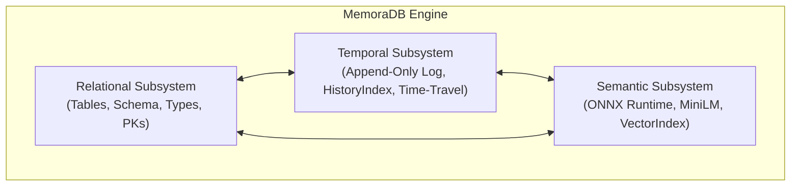

# Core Concepts Overview

MemoraDB bridges three foundational paradigms in modern data management:

1. **Relational Database Management (RDBMS)**: Structured tables, typed columns, primary keys, and SQL-like declarative queries.
2. **Temporal Data Management**: Time-varying data, non-destructive versioning, transaction time tracking, point-in-time snapshots, and history analysis.
3. **Semantic Vector Search**: High-dimensional neural representations of text, metric-space similarity, and semantic ranking.

---

## The Three Pillars of MemoraDB

### 1. Relational Foundation
At its base, MemoraDB manages structured collections called **Tables**. Each table has a defined **Schema** with fixed-size columns, typed attributes (`INT`, `FLOAT`, `STRING`, `BOOL`), and a unique **Primary Key**. Queries are formulated in a SQL dialect that supports selection, projection, filtering (`WHERE`), sorting (`ORDER BY`), and row limits (`LIMIT`).

*Read more:* [Database Basics](database-basics.md)

### 2. Temporal Mechanics
In traditional databases, an `UPDATE` overwrites prior state, and a `DELETE` erases data permanently. MemoraDB implements an **append-only architecture** where state changes are recorded as new, timestamped versions. This provides:
* **Transaction Time Lineage**: Every version records the physical instant it was committed.
* **Point-in-Time Snapshots**: Query what the database looked like at any instant in the past using `AS OF` or `SNAPSHOT`.
* **Evolution & Diffs**: Trace how individual attributes changed over time using `EVOLUTION` and `COMPARE`.
* **Rollback without Data Loss**: Restore past records by appending them as the newest version.

*Read more:* [Temporal Data](temporal-data.md) and [Snapshots & Versions](snapshots-and-versions.md)

### 3. Semantic Vector Search
Keyword search matches literal words, missing synonyms, context, and semantic intent. MemoraDB integrates a 384-dimensional sentence transformer model (`all-MiniLM-L6-v2`) via Microsoft's ONNX Runtime directly in the DBMS process.
* Columns marked `SEMANTIC` are automatically embedded upon insert and update.
* Queries using `WHERE <col> SIMILAR TO "<text>"` compute cosine similarity between the query embedding and candidate records.
* Candidate generation supports temporal filtering, enabling queries such as *"find notes similar to 'deployment' as they were last week"*.

*Read more:* [Semantic Search Concepts](semantic-search.md)
