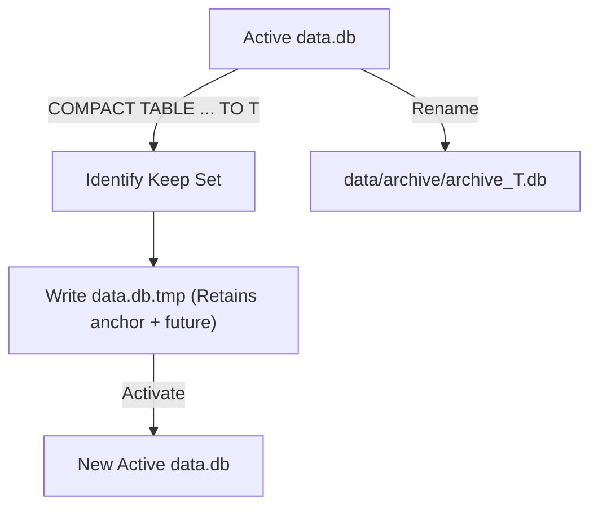

# Snapshots & Versions

This page explains how MemoraDB models point-in-time snapshots, manages record versions, and safely compacts history without data corruption.

---

## Versions vs. Snapshots

To understand temporal operations in MemoraDB, two concepts must be clearly distinguished:

* **Record Version**: A single revision of an individual row. Every `INSERT`, `UPDATE`, and `DELETE` creates a new version with a distinct 64-bit millisecond timestamp and a physical byte offset in `data.db`.
* **Snapshot**: The complete state of an entire table as it existed at a specific point in time `T`. A snapshot is computed dynamically by evaluating the **anchor version** for every primary key in the table as of `T`.

---

## The Anchor Version Algorithm

When you execute a snapshot query such as:

```sql
SELECT * FROM employees AS OF 2026-06-01;
```

MemoraDB does not maintain pre-computed snapshots of the entire table for every second. Instead, it reconstructs the snapshot dynamically:

```text
Table: employees
Keys: ["101", "102", "103"]

For PK "101":
  Versions: [v1 @ Jan 15], [v2 @ Apr 10], [v3 @ Aug 20]
  Target: June 1, 2026
  Anchor: [v2 @ Apr 10] -> ACTIVE -> Included in result

For PK "102":
  Versions: [v1 @ Feb 01], [v2 @ May 20 (DELETE)]
  Target: June 1, 2026
  Anchor: [v2 @ May 20] -> TOMBSTONE -> Excluded from result

For PK "103":
  Versions: [v1 @ Jul 01]
  Target: June 1, 2026
  Anchor: None (did not exist yet) -> Excluded from result
```

### Binary Search via `latestBefore`

Because versions for any given primary key are strictly ordered by time:

1. `HistoryIndex::latestBefore(pk, timestamp)` performs a binary search (`std::ptrdiff_t mid = l + (r - l) / 2`) over the vector of versions.
2. If an anchor version is found whose `timestamp <= targetTimestamp`, that version is inspected.
3. If the record header indicates `deleted == 0`, the record is included in the snapshot.
4. If `deleted == 1` or no version existed prior to `T`, the row is omitted.

---

## History Compaction & Archiving

In an append-only DBMS, disk usage grows monotonically as updates and deletes accumulate. To manage disk space without violating historical integrity, MemoraDB provides the `COMPACT TABLE` statement:

```sql
COMPACT TABLE employees TO 2026-01-01;
```

### The Compaction Process

When compaction executes:

1. **Anchor Identification**:
   * For each primary key, MemoraDB locates the anchor version immediately preceding or equal to the compaction timestamp (`targetTimestamp`).
   * Every version on or after the anchor's timestamp is marked as **keep**.
   * Older versions superseded prior to the anchor are marked for deletion.
2. **Atomic Rewrite**:
   * A temporary file `data.db.tmp` is created.
   * Only the records marked for retention are copied over, writing fresh contiguous offsets into a new in-memory `HistoryIndex`.
   * If a companion vector table (`.vec`) exists, it is rewritten in lockstep (`vt->startRewrite()`, `vt->copyRecord()`, `vt->finishRewrite()`).
3. **Safe Archival**:
   * The original `data.db` is renamed to:
     ```text
     data/<table_name>/archive/archive_<timestamp>.db
     ```
   * The newly compacted `data.db.tmp` is activated as the active `data.db`.
   * No data is destroyed permanently; superseded history is safely preserved in the `archive/` folder for cold storage or audits.


