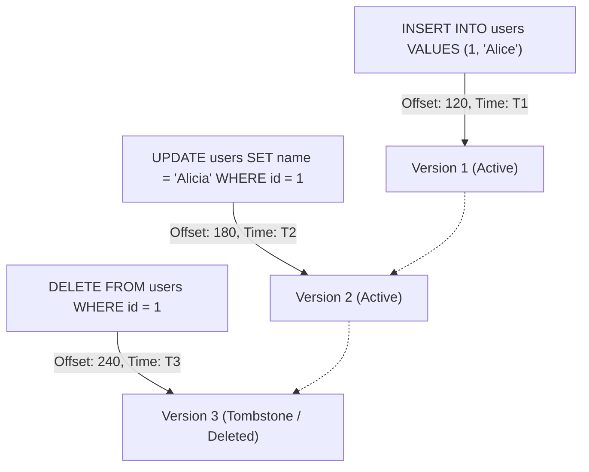

# First Steps with MemoraDB

This guide takes a deeper look into working with MemoraDB's interactive shell, table storage conventions, schema rules, and the fundamental life cycle of records.

---

## The REPL Environment

When you run MemoraDB, you interact with its command-line interface (REPL).

### Statement Termination & Multiline Input

* **Semicolon Termination**: Every SQL query must conclude with a semicolon (`;`).
* **Multiline Queries**: You can break long SQL statements across multiple lines. The shell accumulates tokens until it encounters the unquoted semicolon.
* **String Literals**: Strings can be enclosed in either single quotes (`'hello'`) or double quotes (`"hello"`).
* **Escape Characters**: Backslashes (`\`) allow escaping quotes inside strings.

```sql
memora> CREATE TABLE inventory (
   ...>   sku INT PRIMARY KEY,
   ...>   name STRING(50),
   ...>   price FLOAT
   ...> );
Created table 'inventory' (3 columns)
```

### REPL Commands vs. SQL Statements

The shell distinguishes between SQL queries and administrative meta-commands:

* **SQL Statements**: Parsed by the SQL compiler, must end in `;`, execute against tables.
* **Meta-Commands**: Begin with a dot (`.`), do **not** use a semicolon, and control REPL session state.

```text
memora> .help
memora> .history
memora> .tokens SELECT * FROM inventory;
memora> .clear
memora> .exit
```

---

## Storage Layout on Disk

MemoraDB operates directly on the local filesystem within a directory named `data/` created in your current working directory:

```text
data/
└── inventory/
    ├── data.db          # Binary storage containing table metadata and row records
    ├── archive/         # Stores historical snapshot archives produced during COMPACT
    └── inventory.vec    # (Present only if the table has a SEMANTIC column)
```

When you start the REPL, the `Catalog` scans the `data/` directory and automatically mounts any existing tables, reconstructing in-memory indexes and repairing any incomplete writes via crash recovery.

---

## Schema Rules & Constraints

When designing tables in MemoraDB, keep the following rules in mind:

### 1. Exactly One Primary Key is Required
Every table must designate exactly one column with the `PRIMARY KEY` modifier. Composite keys and tables without primary keys are not supported.

```sql
-- Valid
CREATE TABLE users (id INT PRIMARY KEY, email STRING(50));

-- Invalid: missing PRIMARY KEY
CREATE TABLE users (id INT, email STRING(50));
-- Error: Exactly one primary key is required.
```

### 2. Primary Keys Cannot Be Updated
Once a row is inserted, its primary key value is immutable. If you need to alter a primary key, delete the row and re-insert it.

```sql
UPDATE users SET id = 10 WHERE id = 1;
-- Error: Cannot UPDATE the primary key column 'id' (delete and re-insert instead)
```

### 3. Sizing for `STRING` Columns
Unlike dynamic database systems, MemoraDB uses a fixed-payload binary format. Every `STRING` column definition requires an explicit maximum byte length: `STRING(size)`.

```sql
-- Valid
CREATE TABLE items (id INT PRIMARY KEY, label STRING(100));

-- Invalid: missing size
CREATE TABLE items (id INT PRIMARY KEY, label STRING);
-- Error: STRING column 'label' needs a size, e.g. STRING(50)
```

### 4. Naming Limits
* Table names: Maximum 29 characters (`tns = 30` including null terminator).
* Column names: Maximum 29 characters (`cns = 30` including null terminator).

---

## Record Lifecycle: The Append-Only Model

Understanding how MemoraDB handles records is key to mastering its temporal features.



### 1. Insert
An `INSERT` statement appends a new record to `data.db`, records the current system timestamp, and registers `{timestamp, file_offset}` in the table's in-memory `HistoryIndex`.

### 2. Update
An `UPDATE` statement does **not** overwrite the existing bytes on disk. Instead, it reads the latest record, modifies the targeted fields, and **appends a new record** to the end of `data.db` with a new timestamp.

### 3. Delete (Soft Tombstones)
A `DELETE` statement appends a record with its `deleted` header flag set to `1` (tombstone). The data remains in the history log, but standard `SELECT` queries will no longer return the record.

```sql
-- Insert a row
INSERT INTO inventory VALUES (101, "Widget A", 19.99);

-- Delete the row
DELETE FROM inventory WHERE sku = 101;

-- Standard query returns 0 rows
SELECT * FROM inventory WHERE sku = 101;

-- History query still shows the full story!
HISTORY inventory WHERE sku = 101;
```

---

## Next Steps

* Learn about relational and temporal database theory in [Core Concepts](../concepts/overview.md).
* Explore every supported query command in the [SQL Reference](../sql/overview.md).
* Master point-in-time time travel in the [Temporal Database Guide](../temporal/overview.md).
