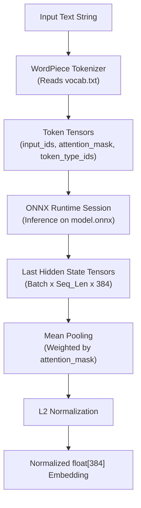

# The Embedding Pipeline

This page describes how MemoraDB converts natural language text into 384-dimensional dense vectors using an in-process transformer model and Microsoft's ONNX Runtime.

---

## Model Architecture: `all-MiniLM-L6-v2`

MemoraDB embeds the **`sentence-transformers/all-MiniLM-L6-v2`** model. This model is widely regarded as one of the best speed-to-quality trade-offs for embedding generation:

* **Base Architecture**: MiniLM (BERT-style transformer architecture).
* **Layers**: 6 transformer encoder layers.
* **Hidden Size**: 384 dimensions (`VEC_DIM = 384`).
* **Parameters**: Approximately 22.7 million parameters.
* **File Size**: ~86 MB on disk (`model.onnx`).
* **Vocabulary**: WordPiece tokenization with ~30,522 tokens (`vocab.txt`).

---

## The In-Process Inference Workflow

When text is submitted (either during `INSERT`/`UPDATE` or during a `SIMILAR TO` query), the `MiniLmEmbedder` executes the following sequence:



### 1. Tokenization
The input string is broken down into subword tokens using WordPiece rules:
* Special tokens `[CLS]` (start of sequence) and `[SEP]` (end of sequence) are prepended and appended.
* Three 64-bit integer tensor buffers are constructed: `input_ids`, `attention_mask`, and `token_type_ids`.

### 2. ONNX Runtime Execution
The tensors are passed to `Ort::Session::Run`:
* Inference executes entirely within the `memora` process on the CPU.
* No inter-process communication (IPC) or network requests occur.

### 3. Mean Pooling & Normalization
* **Mean Pooling**: The transformer's output token embeddings are averaged across the sequence length, taking into account the attention mask so padding tokens do not distort the representation.
* **L2 Normalization**: The resulting vector is divided by its Euclidean norm, ensuring unit length (`||v|| = 1.0`). Unit length simplifies similarity calculations so that cosine similarity reduces directly to the dot product.

---

## Model Directory Resolution

At startup, MemoraDB dynamically discovers where the model assets live:

```cpp
std::filesystem::path getModelDirectory() {
#ifdef _WIN32
    char* exePath = nullptr;
    _get_pgmptr(&exePath);
    return std::filesystem::path(exePath).parent_path() / "models" / "all-MiniLM-L6-v2";
#elif defined(__APPLE__)
    // Uses _NSGetExecutablePath
#else
    // Uses /proc/self/exe
#endif
}
```

This ensures that the DBMS executable can be launched from any working directory without breaking its access to the neural network weights.

---

## Performance Considerations

* **In-Memory Retention**: The ONNX session and model graph remain loaded in memory throughout the lifetime of the REPL session, eliminating model loading overhead on successive queries.
* **Embedding Latency**: Generating an embedding on a modern quad-core CPU typically takes between 3 to 10 milliseconds per string.
* **Storage Footprint**: Each embedding consumes exactly 1,536 bytes (384 floats x 4 bytes).
