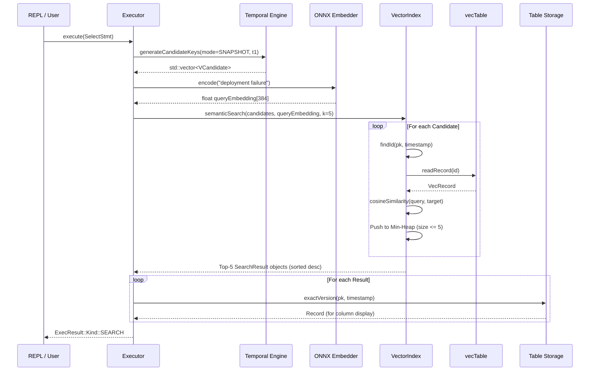

# How Semantic Search Works

This page provides an end-to-end trace of how MemoraDB processes, scores, and ranks records during a semantic vector search query.

---

## Execution Pipeline

When you run a semantic query such as:

```sql
SELECT * FROM notes 
AS OF 2026-09-01 
WHERE body SIMILAR TO "deployment failure" 
LIMIT 5;
```

The engine executes the following six stages:



---

## 1. Candidate Generation
The query's temporal mode determines which candidates to consider:
* **`LATEST`**: Considers only the latest active version of each row (`table.scanLatestKeys()`).
* **`SNAPSHOT` / `AS OF`**: Evaluates the anchor version active at `t1` (`table.snapshotKeys(t1)`).
* **`BETWEEN`**: Gathers all versions committed between `t1` and `t2` (`table.selectBetweenKeys()`).

Tombstoned (deleted) records are excluded from candidate generation.

---

## 2. Query Embedding
The query string (`"deployment failure"`) is passed to the `MiniLmEmbedder`. The in-process ONNX model produces a normalized `float[384]` array.

---

## 3. Cosine Similarity Calculation
For each candidate:
1. The engine calls `VectorIndex::findId(pk, timestamp)` to look up its 32-bit vector ID in the in-memory hash map.
2. `vecTable::readRecord(id)` seeks to `id * sizeof(VecRecord)` in `<table_name>.vec` and reads the 384-dimensional stored embedding.
3. The cosine similarity is computed:
   ```cpp
   float cosineSimilarity(const float (&a)[VEC_DIM], const float (&b)[VEC_DIM]) {
       float dot = 0.0f, magA = 0.0f, magB = 0.0f;
       for (int32_t i = 0; i < VEC_DIM; i++) {
           dot += a[i] * b[i];
           magA += a[i] * a[i];
           magB += b[i] * b[i];
       }
       if (magA == 0.0f || magB == 0.0f) return 0.0f;
       return dot / (std::sqrt(magA) * std::sqrt(magB));
   }
   ```

---

## 4. Top-k Ranking via Min-Heap
To maintain optimal memory and time performance, scores are managed with a min-heap priority queue (`std::priority_queue`):

```cpp
auto compare = [](const SearchResult& a, const SearchResult& b) {
    return a.score > b.score; // Min-heap: lowest score at the top
};
std::priority_queue<SearchResult, std::vector<SearchResult>, decltype(compare)> heap(compare);

for (const auto& candidate : candidates) {
    // ... compute score ...
    if (heap.size() < k) {
        heap.push(result);
    } else if (score > heap.top().score) {
        heap.pop();
        heap.push(result);
    }
}
```

* **Complexity**: `O(N log k)` where `N` is the number of candidates and `k` is the `LIMIT`. This is drastically faster than sorting all `N` candidates (`O(N log N)`).
* **Memory Footprint**: The min-heap holds at most `k` elements at any time, requiring `O(k)` auxiliary memory regardless of how large the table grows.
* Once all candidates are evaluated, elements are popped from the heap and reversed, producing a final list sorted from highest similarity to lowest similarity.

---

## 5. Result Decoration & Display
For each result in the top-k list:
* `exactVersion(table, result.pk, result.timestamp)` fetches the text values of all semantic columns from `data.db`.
* The REPL formats the output into a clean table with columns: `pk`, `timestamp`, `score`, and `<semantic_col>`.
