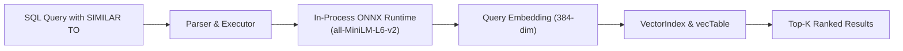

# Semantic Search Overview

MemoraDB features an integrated, in-process semantic vector search subsystem powered by Microsoft's ONNX Runtime and the `all-MiniLM-L6-v2` transformer model.

---

## Architectural Motivation

Most architectures requiring semantic search deploy a dedicated vector database alongside an existing relational database. This introduces substantial complexity:
* Data must be synchronized between two distinct database systems.
* Two network hops are required for each query.
* Ensuring consistent transactional and temporal guarantees across both systems is challenging.

MemoraDB eliminates this overhead by embedding vector inference, vector persistence, and vector indexing directly inside the DBMS process:



---

## Key Components

| Component | Implementation | Description |
|---|---|---|
| **Model** | `all-MiniLM-L6-v2` | A 6-layer MiniLM transformer pre-trained on sentence similarity, outputting 384-dimensional vectors (`VEC_DIM = 384`). |
| **Runtime Engine** | Microsoft ONNX Runtime 1.22.0 | High-performance in-process inference engine loaded via dynamic link library (`onnxruntime.dll`). |
| **Storage (`vecTable`)** | `data/<table_name>/<table_name>.vec` | Dedicated binary file storing vector records (`id`, `pk`, `timestamp`, `embedding[384]`). |
| **Index (`VectorIndex`)** | In-memory hash index | Maps `{pk, timestamp}` composite keys to vector IDs for fast retrieval. |
| **Search Operator** | `SIMILAR TO` | SQL operator used in `WHERE` clauses to specify semantic query text. |
| **Ranking Algorithm** | Min-Heap Priority Queue | Finds top-k highest cosine similarity scores in `O(N log k)` time. |

---

## The `SEMANTIC` Column Modifier

To enable semantic search on a table, designate one or more `STRING` columns with the `SEMANTIC` modifier during table creation:

```sql
CREATE TABLE knowledge_base (
    id INT PRIMARY KEY,
    title STRING(60),
    content STRING(500) SEMANTIC
);
```

Whenever a row is inserted or updated:
1. MemoraDB extracts the text from all `SEMANTIC` columns.
2. The `MiniLmEmbedder` tokenizes the text and runs the ONNX model in-process.
3. The resulting 384-dimensional float vector is written to `<table_name>.vec`.

---

## Documentation Guide

* [SIMILAR TO Queries](similar-to.md) — Query syntax, scoring, limits, and combined temporal-semantic queries.
* [Embedding Pipeline](embedding-pipeline.md) — Tokenization, model inference, and ONNX Runtime integration.
* [How It Works](how-it-works.md) — Cosine similarity calculation, candidate generation, and top-k ranking.
