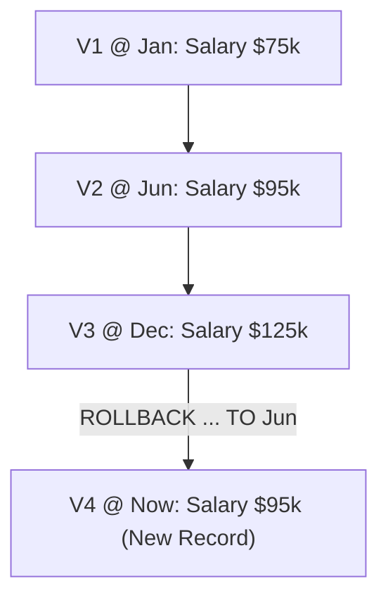

# ROLLBACK

## Description

The `ROLLBACK` statement restores one or more rows—or an entire table—to a historical point in time.

---

## Non-Destructive Append-Only Semantics

In traditional databases, rolling back implies undoing transactions by modifying storage or truncating logs.

In MemoraDB's append-only model, **ROLLBACK is strictly non-destructive**:



1. It does **not** erase, overwrite, or delete versions committed after the target date.
2. It queries the version active as of the target timestamp (`selectAsOf`).
3. It **appends a brand new record** with the historical payload, stamped with the **current time**.
4. The rollback action itself becomes a documented event in the row's ongoing version history!

---

## Syntax

*(See the [Syntax Notation Guide](../reference/grammar.md#syntax-notation-guide) for notation rules).*

### Basic syntax

```sql
ROLLBACK <table> WHERE <condition> TO <date>;
```

### Full syntax

```sql
-- Row-level rollback
ROLLBACK <table> WHERE <condition> TO <date>;

-- Whole-table rollback
ROLLBACK TABLE <table> TO <date>;
```

---

## Parameters

| Parameter | Description |
|---|---|
| `<table>` | Target table name. |
| `WHERE <condition>` | Required for row-level rollback. Identifies the row(s) to restore. |
| `TO <date>` | The historical date or timestamp to restore state from. |

---

## Examples (`employees`)

### 1. Row-Level Rollback

Restore row `1` to its state as of September 1, 2026:

```sql
ROLLBACK employees WHERE id = 1 TO 2026-09-01;
```

**Expected Output:**
```text
1 row(s) rolled back
```

### 2. Whole-Table Rollback

Restore all rows in the table to their state as of January 1, 2026:

```sql
ROLLBACK TABLE employees TO 2026-01-01;
```

**Expected Output:**
```text
Table 'employees' rolled back
```

---

## How It Works

* **Row-Level (`Table::rollback(pk, ts)`)**:
  1. Calls `selectAsOf(pk, ts)` to retrieve the active historical record.
  2. If a valid record is found, calls `appendRecord(record)`.
  3. Writes a new record header with the current timestamp and appends the payload to `data.db`.
  4. Registers the new version in `HistoryIndex`.
* **Whole-Table (`Table::rollback(ts)`)**:
  1. Iterates over all known primary keys in `HistoryIndex`.
  2. Calls `selectAsOf(pk, ts)` for each key.
  3. Appends each retrieved record as a new version.

---

## Errors & Edge Cases

| Error Condition | Error Message |
|---|---|
| No Row Existed Before Date | `Rollback of table '<table>' failed (no row had a version before the given timestamp)` |
| Missing WHERE in Row Form | `ROLLBACK without TABLE requires a WHERE clause` |
| Table Does Not Exist | `No such table: '<table>'` |

---

## Related Commands

* [`AS OF`](as-of.md) — Inspect historical state before rolling back.
* [`HISTORY`](history.md) — Verify that the rollback created a new version.
